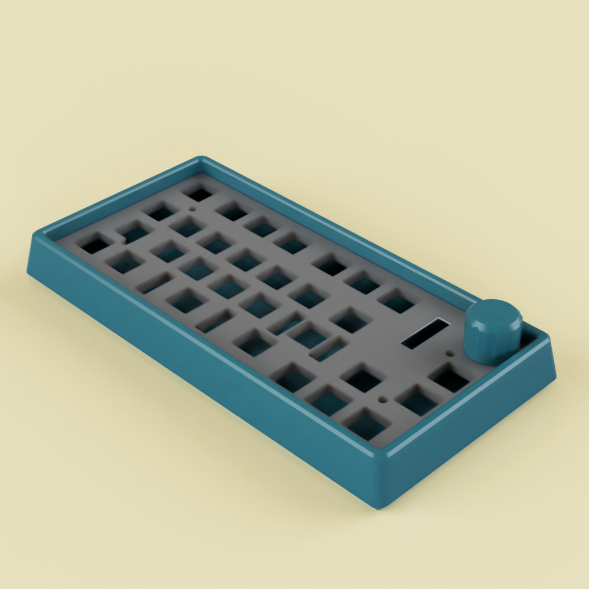
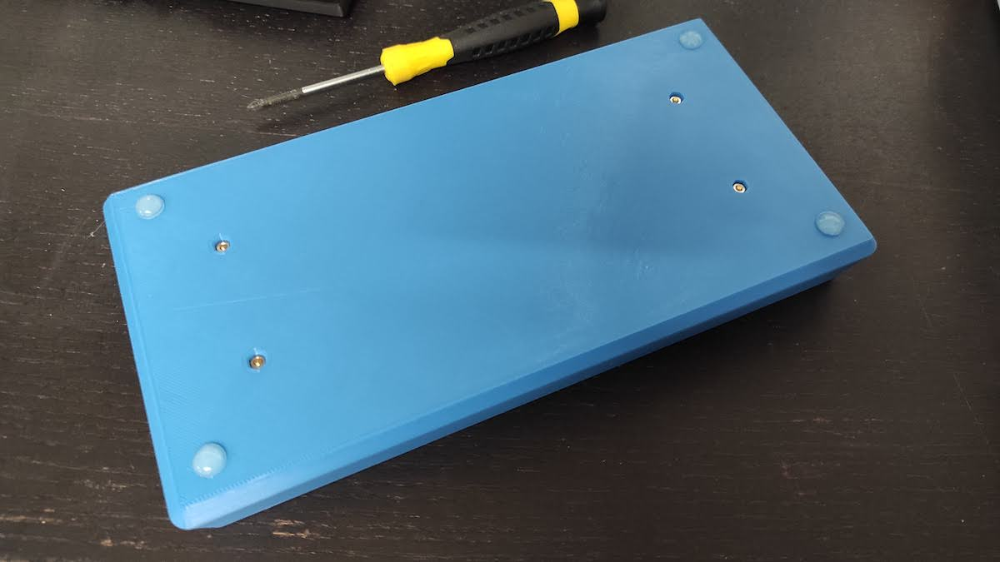
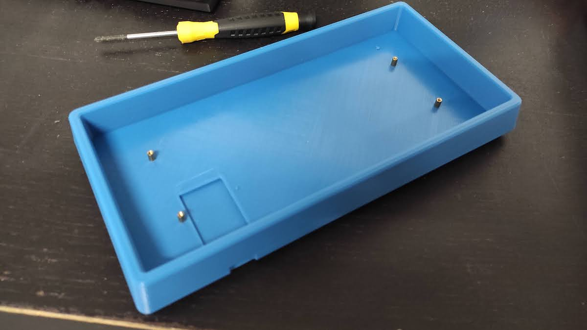

# 3D printed case

A simple tray-mount case for the Dissatisfaction30.
Consists of a 5mm thick plate, which is secured to the case using the 4 screw holes of the PCB, mounted on standoffs.
If you want to use this case, you should use normal header pins to solder the EliteC/Pro micro to the PCB.

### Hardware required
- 5mm M2 standoffs (4x)
- M2 screws, about 5mm (4x)
- M2 nuts (4x)

### Printing
Print the plate and the knob upside down, no supports are required. You will have to punch open the 4 screw holes in the plate.

### Building
- Push the 4 nuts into the holes at the bottom of the case. Screw the standoffs into the holes from the top and tighten them.
- You can put some 2-3mm foam at the bottom of the case to act as sound dampener if you want.
- Sandwich the plate between the PCB and the switches, and drop it into the case.
- Use the 4 screws to secure the plate to the standoffs.

